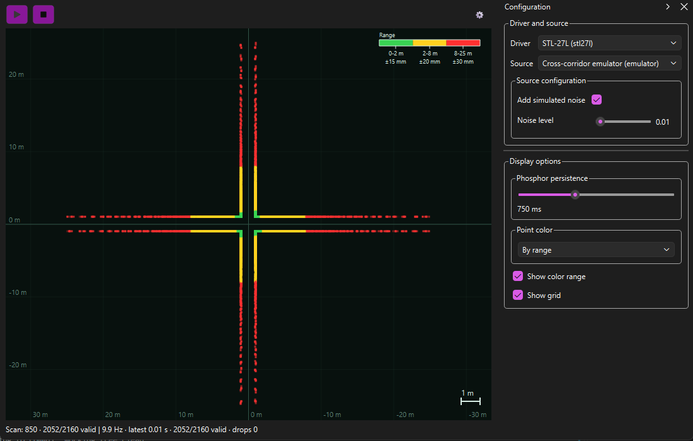

# Lidar-Shark

<p align="center">
  
</p>

Lidar-Shark is an interactive top-down 2D LiDAR viewer for inspecting live and
emulated scans. The interface is organized around a large scan view: the dark
grid represents the metric workspace, the sensor is shown at the origin, and
valid returns appear as colored points. Green indicates the nearest range,
yellow the middle band, and red the farthest returns. The top-left controls
start and stop acquisition; the status bar reports the current scan, valid
samples, update rate, and dropped samples. The Configuration panel on the right
selects the driver and source, exposes emulator settings such as simulated noise,
and controls persistence, point coloring, the range legend, and the grid.



The figure below shows a live scan from the STL-27L driver's cross-corridor
emulator. The emulator generates the same SDK scan data that a compatible source
would publish, without requiring physical hardware. The central plot is a
top-down Cartesian view of the sensor: the origin is at the centre,
the vertical axis points towards the sensor front, and the horizontal axis shows
the left/right direction. Each colored mark is a valid measured return. The
four arms of the simulated corridor appear as the four bands extending from the
origin. The range legend in the upper-right of the plot maps green, yellow, and
red to near, intermediate, and far returns respectively; the grid and scale
marker provide metric reference.

The control panel on the right is divided into two sections. **Driver and
source** identifies the selected provider and its data source and exposes the
source-specific configuration, including the optional simulated noise level.
**Display options** controls phosphor persistence, point coloring, the range
legend, and the metric grid. The status line at the bottom reports the scan ID,
the number of valid samples out of the total, the publication rate, the age of
the latest scan, and any dropped samples.

The viewer obtains this data through the `lidar-sdk` provider contract. At
startup it discovers installed providers and populates the driver and source
selectors from their descriptors. The viewer does not import `stl27l_driver`
directly, so the same interface can be used with the STL-27L driver and its
emulated source, or with another compatible provider and source.

## Install and run

From PowerShell, using the two sibling repositories:

```powershell
python -m pip install -e ..\stl27l-driver\sdk
python -m pip install -e .
python -m lidar_shark
```

For a POSIX shell, use the same commands with `../stl27l-driver/sdk` and
`../stl27l-driver` paths.

The deterministic fixture provider is available without hardware:

```powershell
python -m pip install -e ..\stl27l-driver\sdk
python -m pip install -e .\fixture-provider
python -m pip install -e .
python -m lidar_shark
```

## Current viewer behavior

- Provider and source selection are populated from SDK descriptors.
- Acquisition runs outside the Qt UI thread and tolerates normal subscription timeouts and closure.
- The canvas shows valid returns only, with front up and left to the left (`plot_x=-Y/1000`, `plot_y=X/1000`).
- Range coloring, persistence, metric grid, zoom, pan, recenter, cursor coordinates, and point selection are available.
- The configuration dock exposes source configuration and display controls.
- The status line shows scan identity, valid/total samples, stream timing, drops, and selected-point details when available.

## Tests

Run focused tests first, then the complete suite:

```powershell
python -m pytest -q tests/test_orientation.py tests/test_scan_view.py tests/test_acquisition.py
python -m pytest -q
```

The tests use the SDK models and fake sources; they do not validate physical hardware.

Recording, replay, A/B and sector measurements, settings persistence, PNG export, and
provider refresh are not part of the current viewer surface yet.
